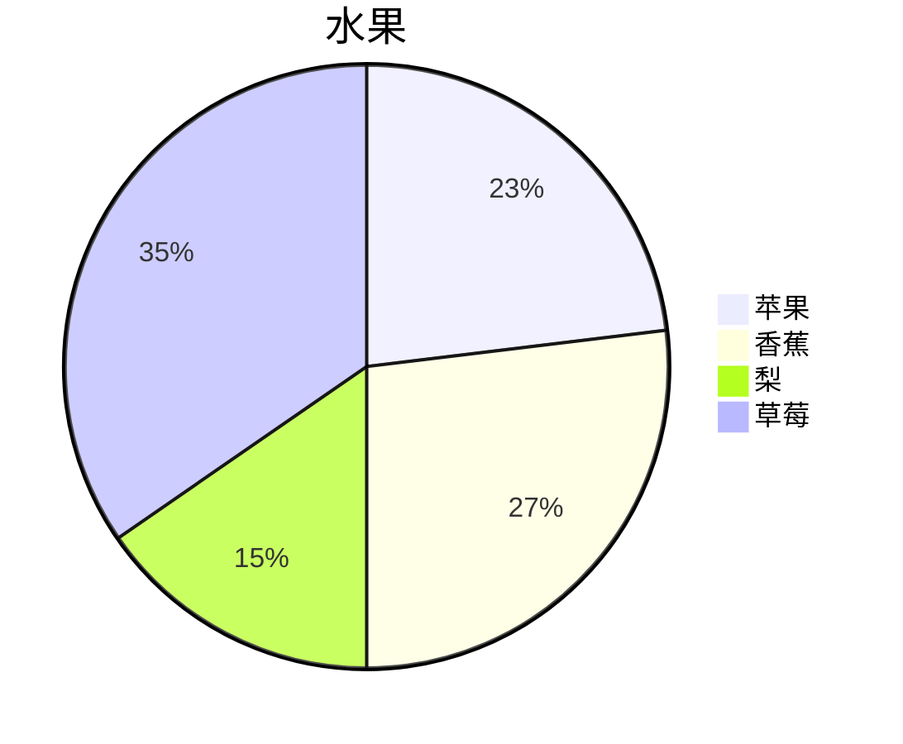
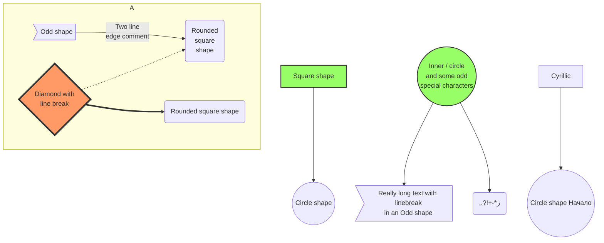

# Mermaid

## 饼图

```mermaid
pie
	title 水果
	"苹果" : 60
	"香蕉" : 70
    "梨" : 40
    "草莓" : 90
```

## 流程图

**流程图方向:**

- TB——从上到下
- TD - 自上而下/与自上而下相同
- BT-- 从下到上
- RL——从右到左
- LR——从左到右

```mermaid
flowchart LR
	A([不存在]) --> |onCreate| B([初始状态])
	B --> |onDestroy| A
	B --> |onStart| C([就绪状态])
	C --> |onStop| B
	C --> |onResume| D([活跃状态])
	D --> |onPause| C
```

```mermaid
graph TB
    sq[Square shape] --> ci((Circle shape))

    subgraph A
        od>Odd shape]-- Two line<br/>edge comment --> ro
        di{Diamond with <br/> line break} -.-> ro(Rounded<br>square<br>shape)
        di==>ro2(Rounded square shape)
    end

    %% Notice that no text in shape are added here instead that is appended further down
    e --> od3>Really long text with linebreak<br>in an Odd shape]

    %% Comments after double percent signs
    e((Inner / circle<br>and some odd <br>special characters)) --> f(,.?!+-*ز)

    cyr[Cyrillic]-->cyr2((Circle shape Начало));

     classDef green fill:#9f6,stroke:#333,stroke-width:2px;
     classDef orange fill:#f96,stroke:#333,stroke-width:4px;
     class sq,e green
     class di orange

```

